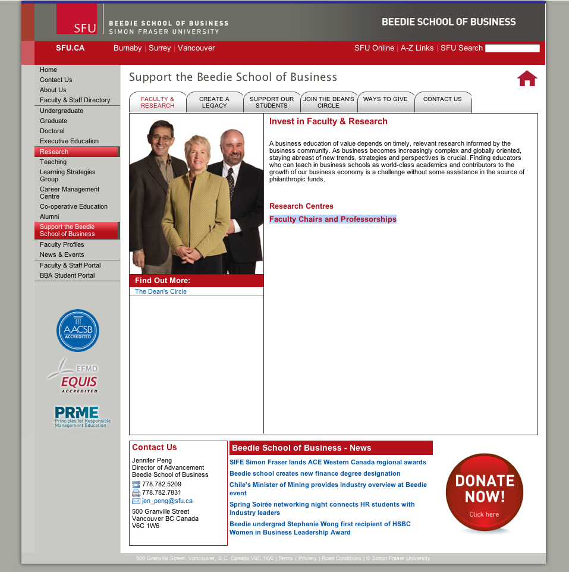
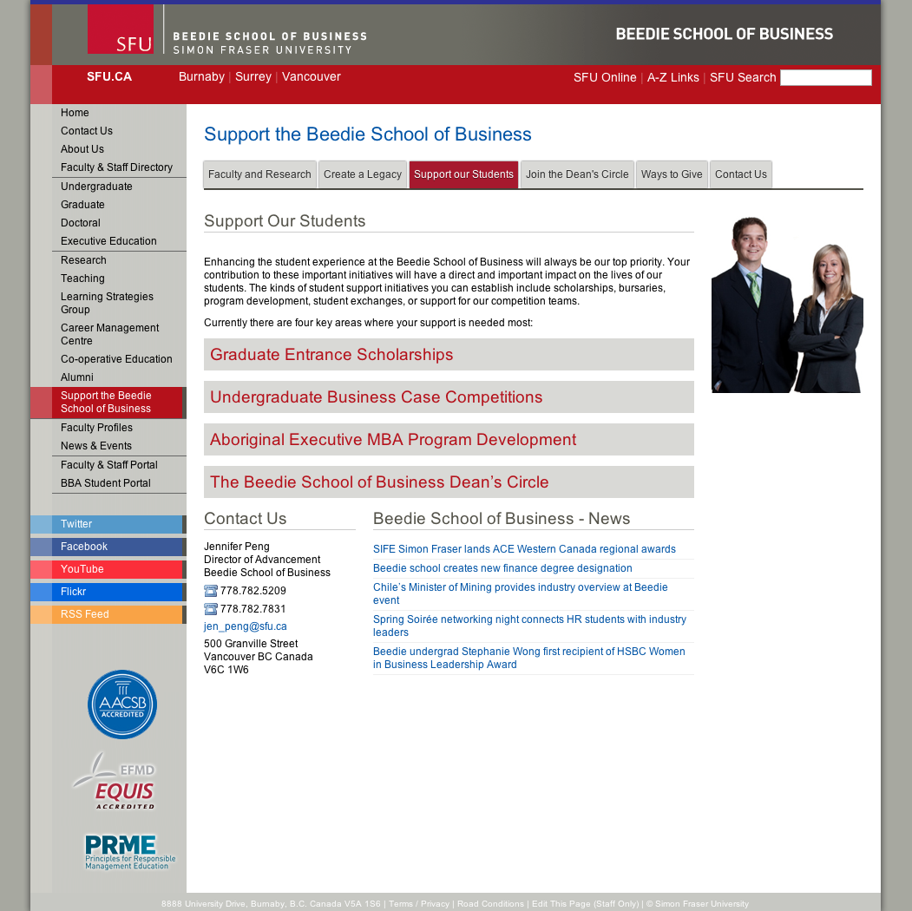
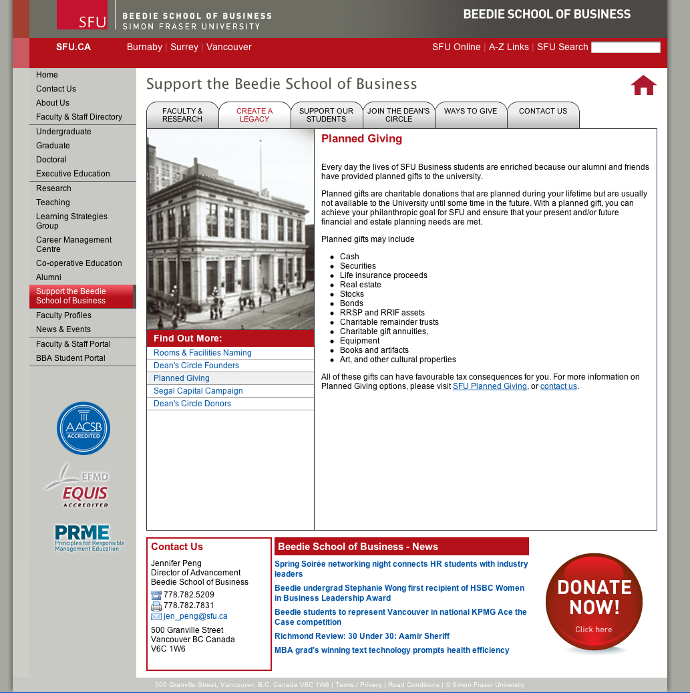
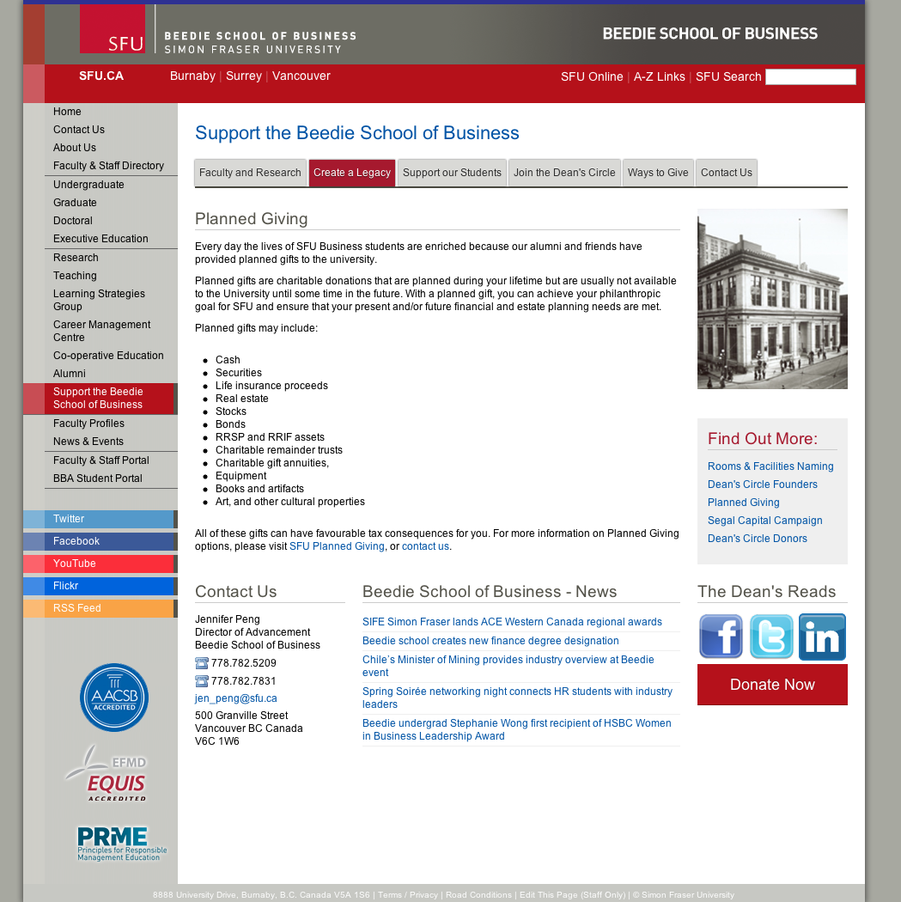

During my internship at Beedie School of Business as a Web Services Developer Assistant I overtook a redesign of the faculty website. As a result of this redesign Beedie School of Business became the first SFU website to adapt a responsive design long before SFU embraced it in its own redesign later. As part of the redesign new Marqui CMS templates were created as well as a matching Wordpress theme as some parts of the site were powered by Wordpress.

Screenshots below demonstrate some pages of the site before and after the redesign.

