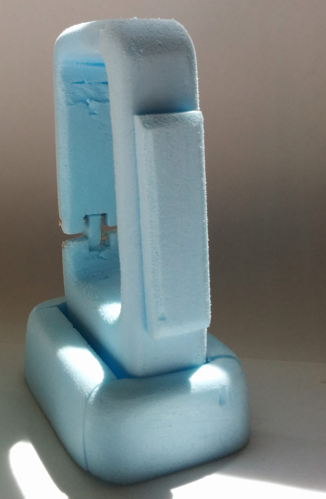
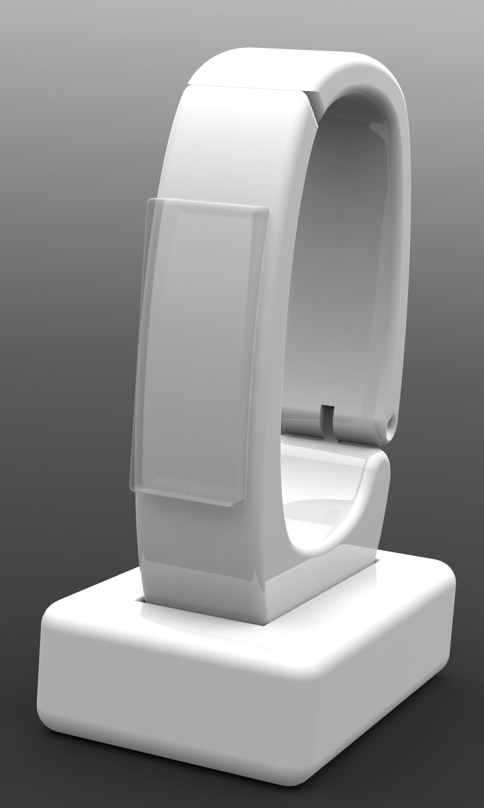
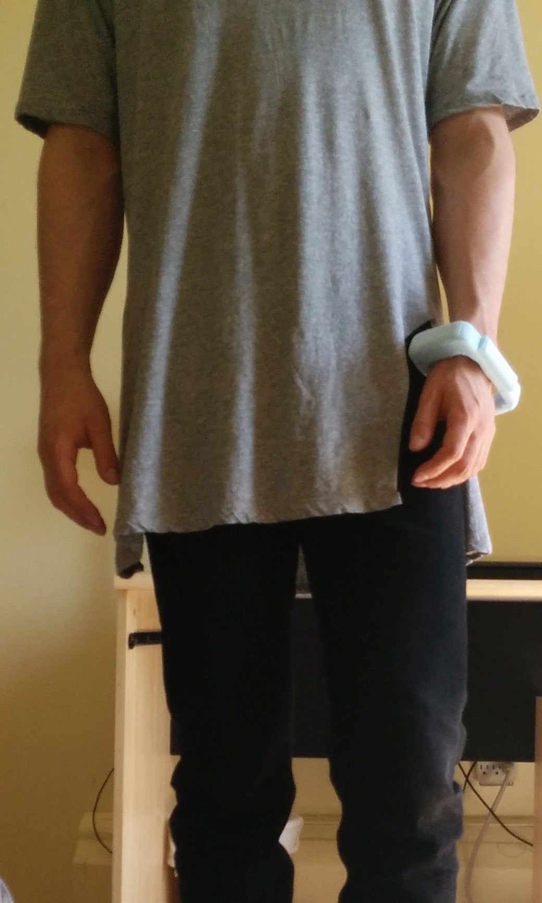
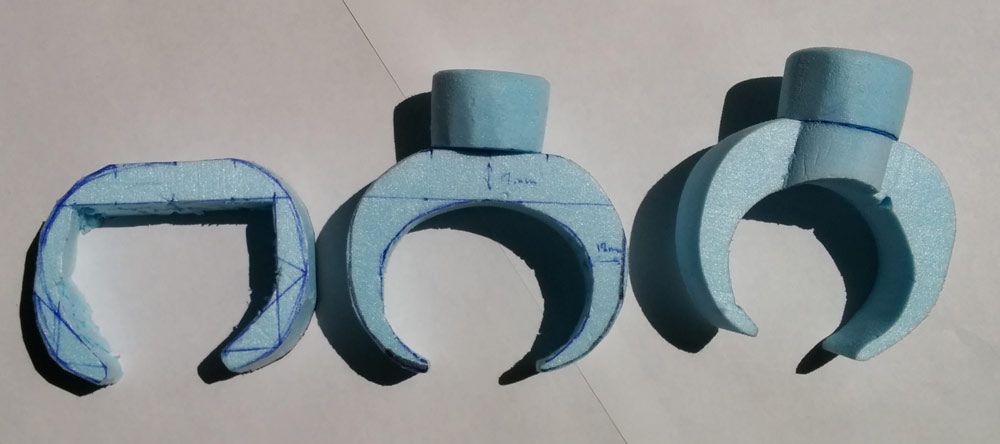

This wearable bracelet flashlight prorotype was made for a course in design materials. The wearable prototype was build out of blue foam. The design has gone through many iterations prior to being finalized. Several prototypes were made.

