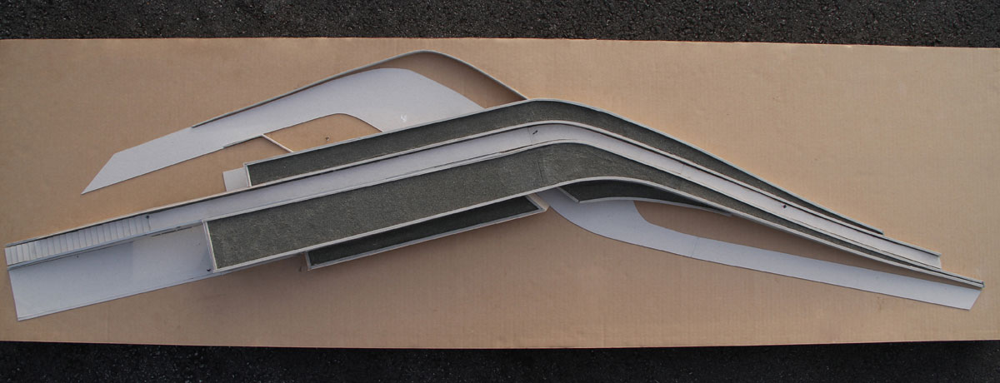
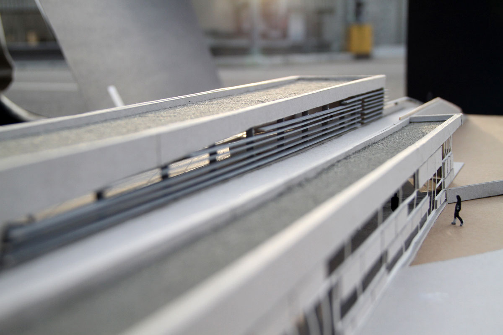
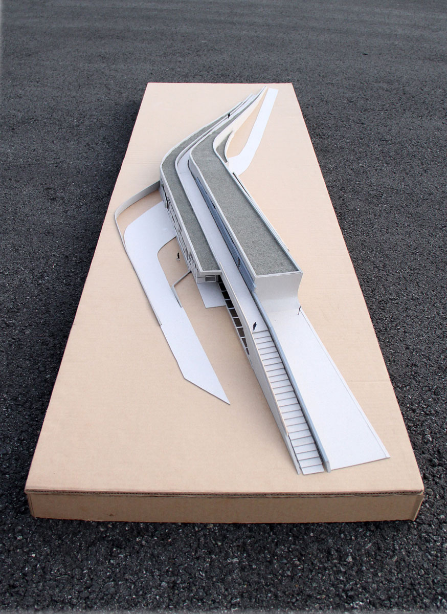
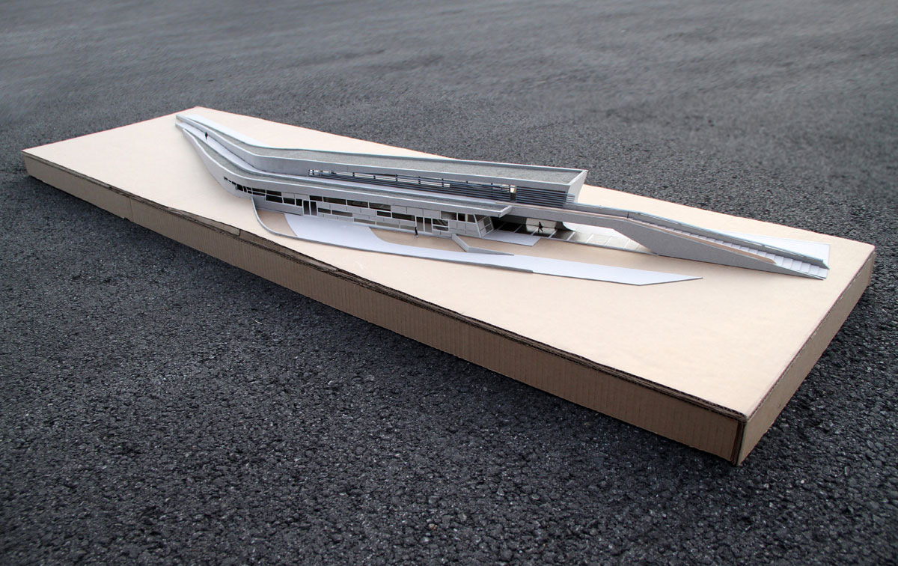
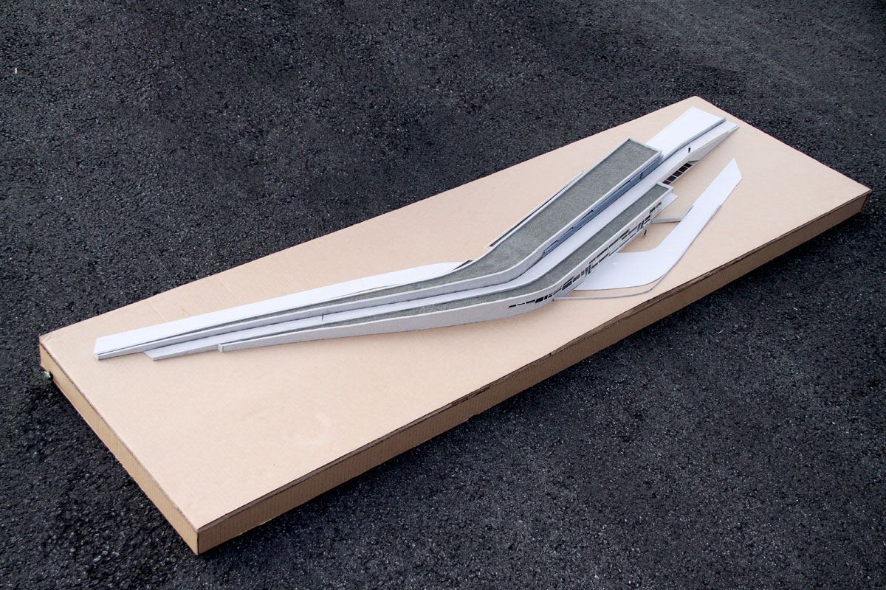
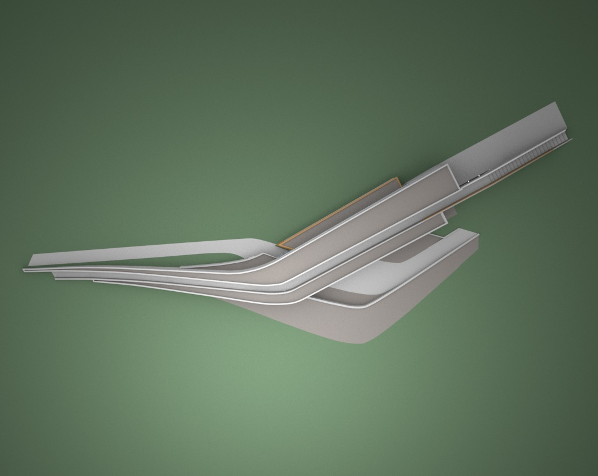
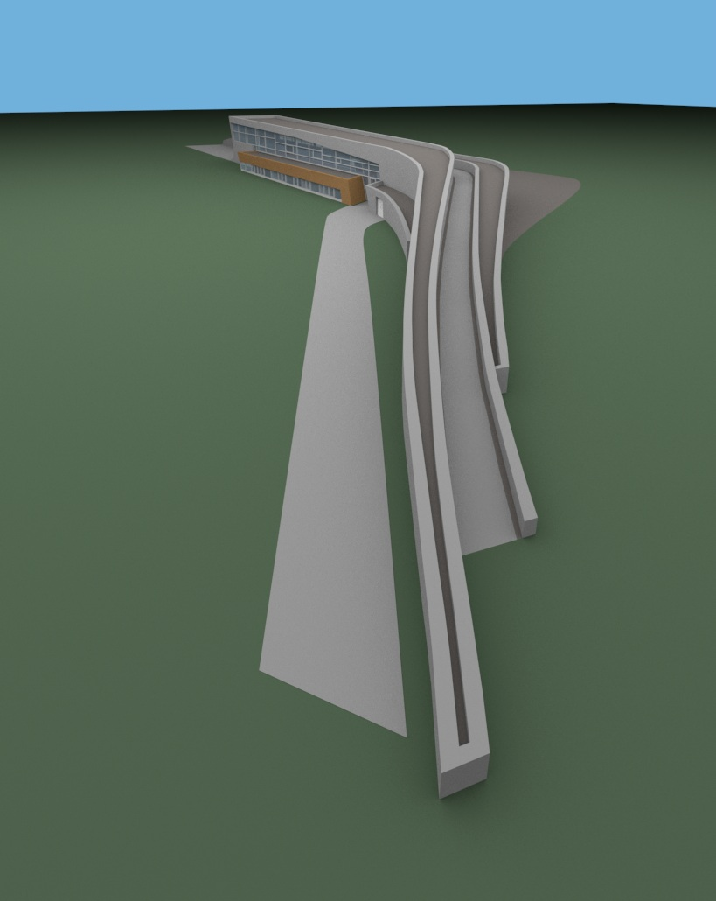
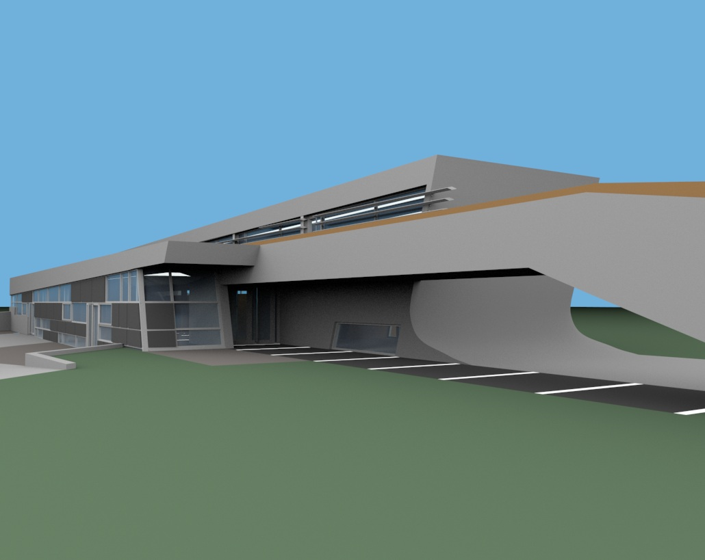
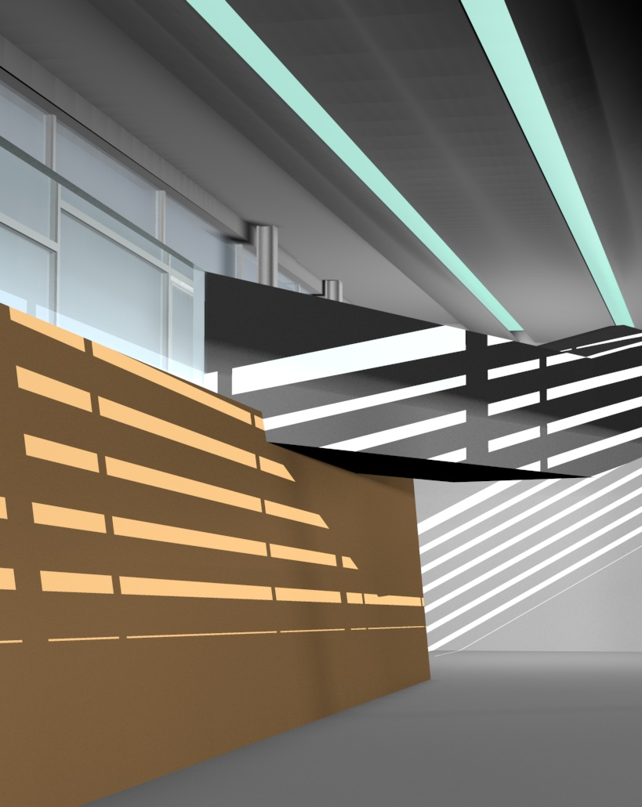

[LFOne](http://www.zaha-hadid.com/architecture/landesgardenschau-landscape-formation-one/) is a building by a world-renowned arhitect Zaha Hadid located in Weil am Rhein, Germany. The architectural model and renders shown here were assigned as a project for a course in spatial design at SFU's School of Interactive Arts & Technology (SIAT).

