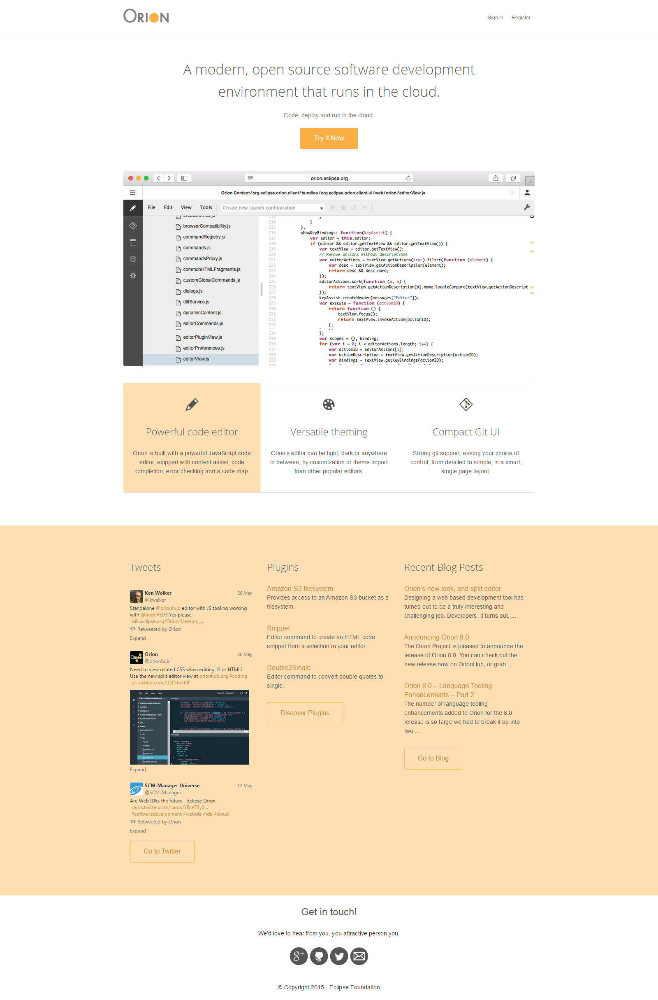

During my internship at IBM Canada as a Javascript developer I worked on the Orion Web IDE project team.
Orion is an [open-source project](https://github.com/eclipse/orion.client) and a part of Eclipse family
of projects. It is also part of a larger IBM [Bluemix](https://en.wikipedia.org/wiki/Bluemix) project -
a cloud-based platform for  building, running, deploying and managing applications.

I undertook the redesign of the landing and registration pages used for [OrionHub](http://orionhub.org),
a website that allows those interested in Orion to try it out. These pages are fully responsive, utilizing
a flexbox-based grid system which I made specifically for this project.

    <video src="../img/orion/orion_mobile.webm" poster="../img/orion/poster-1.png" controls></video>
    <video src="../img/orion/orion_mobile_reg.webm" poster="../img/orion/poster-2.png" controls></video>

I was also in charge of functionality and UX relating to editor theming. I implemented theme importing from
Sublime Text, Brackets and Eclipse. Themes can also be exported in a form of a JSON file. Themes can be imported, modified and exported from Orion's theme editing interface and shared with other Orion users. They can also be created from scratch in the same interface.

    <video src="../img/orion/themes.webm" poster="../img/orion/poster-theme-import.png" controls></video>

