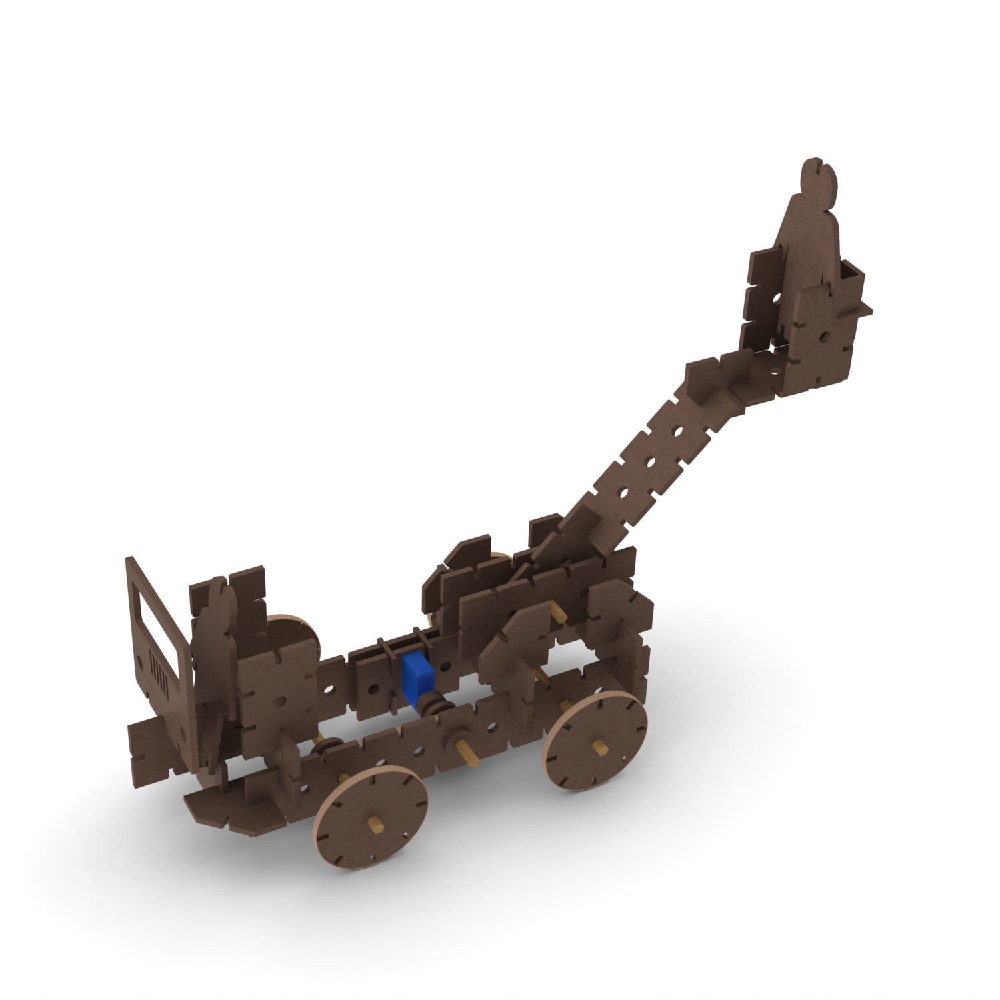
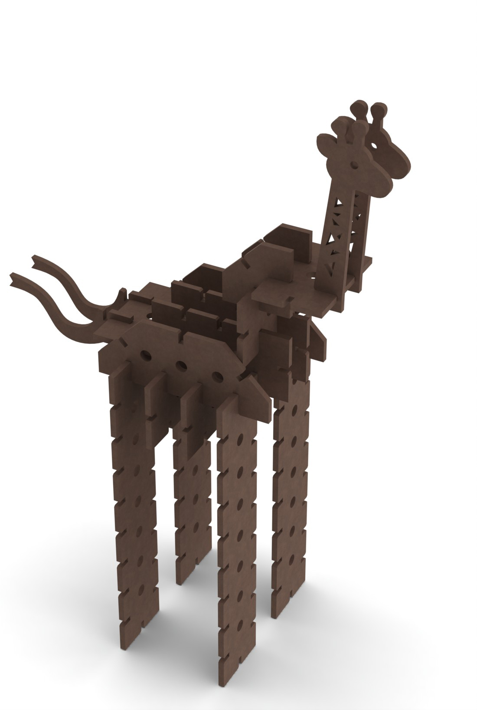
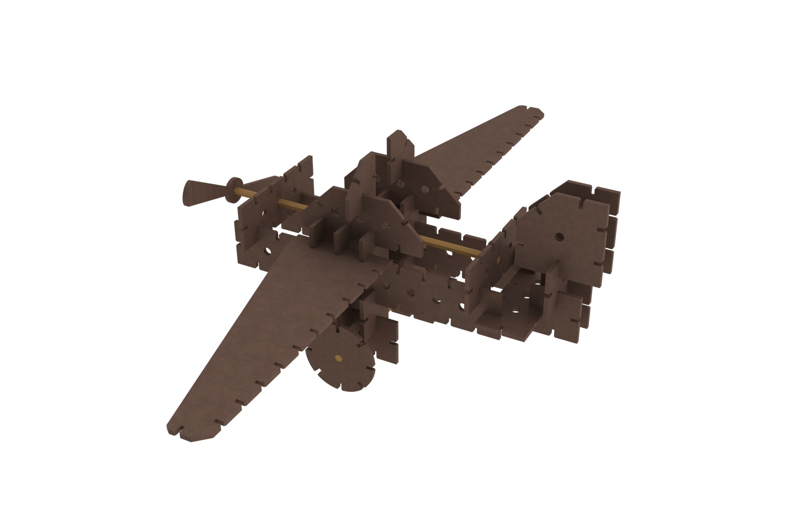
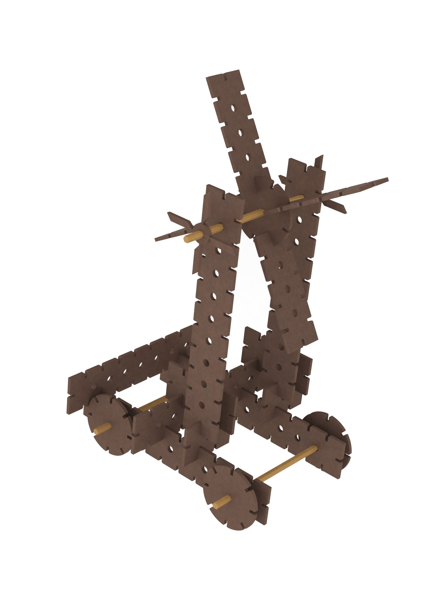

For a project in Design Fabrication Techniques course my team created a toy kit. Pieces included in the kit are cut out carboard and can be combined into various toys. These toys can also be mechanized by addition of actuators.

The use of cardboard ensures that toys are cheap and environmentally friendly. Also, since the source material is plentiful and cheap, these toys can be broken without worrying about replacement costs. The ease of fabrication also allows for an unlimited variety of toy parts and toys made with them.

